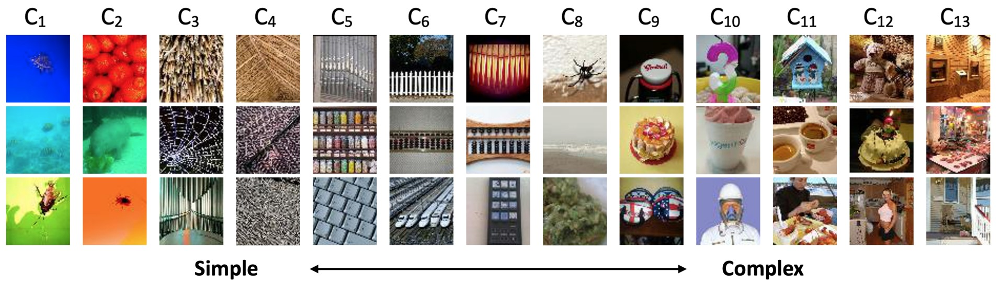
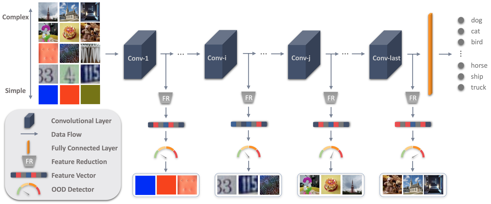

[![Contributors][contributors-shield]][contributors-url]
[![Issues][issues-shield]][issues-url]
[![Stars][stars-shield]][stars-url]
[![LinkedIn][linkedin-shield]][linkedin-url]


<!-- Graphical abstract -->
<br />
<p align="center">
    

  <h2 align="center">Layer Adaptive Out-of-Distribution detection for CS640</h2>

  <p align="center">
    Preliminary results of LA-OOD on in-distribution CIFAR10 and OOD Tiny ImageNet on VGG16 backbone.
    <br />
  </p>
</p>
<p align="center">
  
</p>


# Team members
## GM Harshvardhan
- Email: [gmharsh@bu.edu](mailto:gmharsh@bu.edu)
## Harshil Gandhi
- Email: [harshilgandhi@bu.edu](mailto:harshilg@bu.edu)
## Kathakoli Sengupta
- Email: [ksg25@bu.edu](mailto:ksg25@bu.edu)

# Overview

In this project, we will be using Wang's LA-OOD https://github.com/haoliangwang86/LA-OOD (paper: https://arxiv.org/pdf/2203.00192.pdf) for out-of-distribution detection on satellite images on So2Sat (https://github.com/zhu-xlab/So2Sat-LCZ42).


# Implementation (preliminary)
The implementation pipeline is as follows:

## 1. Train the backbone models
```python
python train_backbone_model.py --model vgg16 --dataset cifar10
```

## 2. Download the OOD datasets
Download the following dataset:
* Tiny ImageNet: https://image-net.org/index.php

save the unzipped files in ./data folder


## 3. Generate the dataset
Generate the InD and OOD datasets:
```python
python generate_datasets.py
```

## 4. Save the intermedia outputs
```python
python save_inter_outputs.py --model vgg16 --ind cifar10
```

## 5. Train OOD detectors
```python
python train_ood_detectors.py --model vgg16 --ind cifar10
```

The above step trains all the One-Class SVMs (OCSVMs) to detect whether an image is out-of-distribution or not.


## 6. Test: OOD detection
```python
python detect_oods.py --model vgg16 --ind cifar10
```


[contributors-shield]: https://img.shields.io/github/contributors/GM-git-dotcom/la_ood_cs640.svg?style=flat-square
[contributors-url]: https://github.com/GM-git-dotcom/la_ood_cs640/graphs/contributors
[stars-shield]: https://img.shields.io/github/stars/GM-git-dotcom/la_ood_cs640.svg?style=flat-square
[stars-url]: https://github.com/GM-git-dotcom/la_ood_cs640/stargazers
[issues-shield]: https://img.shields.io/github/issues/GM-git-dotcom/la_ood_cs640.svg?style=flat-square
[issues-url]: https://github.com/GM-git-dotcom/la_ood_cs640/issues
[linkedin-shield]: https://img.shields.io/badge/-LinkedIn-black.svg?style=flat-square&logo=linkedin&colorB=555
[linkedin-url]: https://linkedin.com/in/gm-harshvardhan/
